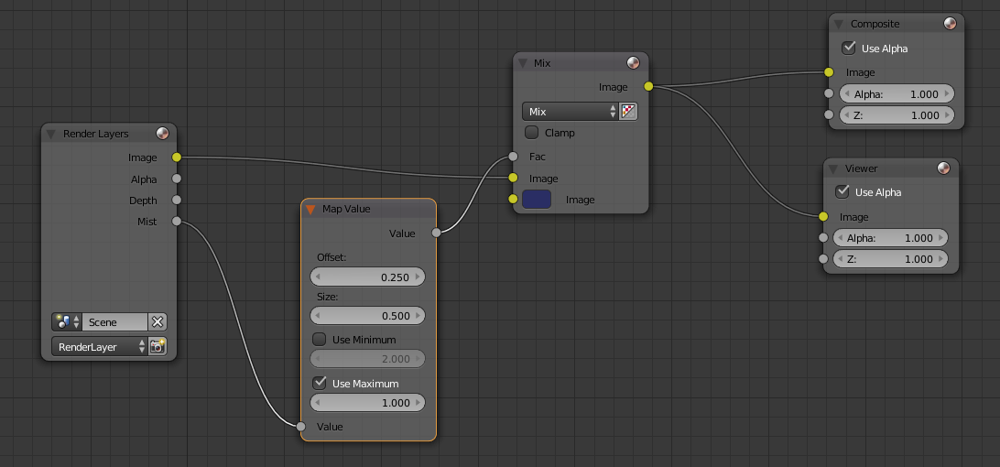

MAKING A VISUAL REPRESENTATION OF BATHYMETRY DATA IN BLENDER
===

Note: While making the model, occasionally save the project by pressing Ctrl + S or going to *file -> Save*

## SECTION 1 - Making a Blender Model From A Heightmap

### PREPARE THE PROJECT BY:

 1. Opening Blender 2.79
 
 2. Deleting the existing cube in the 3D viewport by right-clicking it, pressing Delete or X to open the Delete menu, and select Delete.
 
 3. Deleting the existing lamp in the 3D viewport by right-clicking it, pressing Delete or X to open the Delete menu, and select Delete.
 
 4. Having the heightmap picture and Logo Picture available on the computer

### MAKE THE BLENDER MODEL:
   1. Press **SHIFT+A** to open the Add menu 
       *(Note: The mouse pointer must be in the 3D viewport)* 
     
   2. Select **Mesh > Grid**
   
   3. Under the Tool shelf Tab, under Add Grid, change the values of “X subdivisions” and “Y subdivisions” to AAA 
   
   *(The Toolshelf tab is typically open by default and can be found on the left side of the screen. If it is not open, press T on the 
   keyboard to open or close it while the mouse hovers anywhere over the 3D viewport.)*

   4. Click on Textures under the Properties Viewport (Right side of the screen)
   
   5. Click on the *New button* to add a new texture

   6. Click on the *Open* button to select an image
   
   7. Locate the heightmap for the blender creation in the filesystem, and select it
   
   8. Under *Image Mapping* on Blender under Textures, click on the *extension Repeat*, and select **Extend** instead
   
   9. Go to Modifies under the Properties Viewport
   
   10. Click on *Add Modifier* and select *Displace* to add a displace modifier
   
   11.Click the *texture icon* (directly to the left of the *new* button under the new window that appeared from the Displace modifier) and select the *heightmap texture*
   
   *This should result in the flat square changing shape into an exaggerated version of the heightmap model*
   
   12. Change the *Midlevel* value to 0
   
   13. Change the *Strength* value to X
   
**Section 1 is Finished.**
   
## SECTION 3 - Adding the Textures and refining the model

   1. Click on *Add Modifier* and select the *Subdivision Surface* modifier
   
   2. Under *Subdivision Surface* click the upwards pointing triangle to change its position to be above the Displace modifier
   
   3. Select *Simple* instead of Catmull-Clark
   
   4. Change *Subdivisions View* to 2, make the value lower if the computer cannot handle it and higher if the computer can 
   handle it, but more than 0 is not necessary
   
   5. Change the *Subdivision Render* to 3
   
   6. Under the *Toolshelf*, under *Tools*, under *Edit*, under *Shading*, select *Smooth*

   7. Under the properties window, go to *object* (Icon shaped like a orange cube)
  
   8. Under *transform*, change the Scale of X. The value depends on the ratio of the heightmap image. In the case of the still 
      example’s heightmap, the ratio of the height to width of the image was 1:1.4999..., and so the scale of x had to be changed from 1 
      to 1.49
      
   9. Bring the mouse into the 3D viewport, press **S** on the keyboard
   
   10. Without moving the mouse, press **6** (or another number depending on the preffered size of the model, changing the size of the 
       model is to make it more comfortable to work with especially when setting the camera, the size can be adjusted later on using 
       this same method) on the keyboard, then **enter**
   
   11. Uner the properties window, go to *material* (icon shaped like a silver sphere)
   
   12. Click on *new*
   
   13. Under *Surface* click *Use Nodes*
   
   14. At the bottom of the 3D viewport, along the bar on the far left side, click on the 3D *viewport options* (icon shaped like a grey 
       cube) and select *node editor*
       
   15. Press **SHIFT + A** on the keyboard, and select *Shader > Glossy BSDF*
   
   16. Place the *glossy shader* underneath the *Diffuse BSDF* node by movint the mouse pointer to the place and clicking
   
   17. Press **SHIFT + A** on the keyboard, go to *shader* and click on *mix shader*
   
   18.Place the *Mix Shader* between the *Diffuse BSDF* node and the *Material Output* node by hovering the node above the string 
      connecting the two other nodes so they have a orange outline, and click
   
   19.Click and hold the green dot on the *Glossy BSDF* node titled *BSDF*, then move the mouse to the green dot on the *Mix Shader* '
      node labelled *Shader*, underneath the *Shader* dot which the *Diffuse BSDF* is linked to, and release the mouse
      
   20. Change the *Roughness* value of the *Glossy BSDF* node to 0.2
   
   
   21. On the *Diffuse BSDF* and *Glossy BSDF* node, click on the white square in order to change the colour. 
       The colours of the shader nodes can be adjusted depending on what the desired result is, and what the seafloor is made of. In the 
       example still, the *Diffuse BSDF* colour is: R: 0.053, G: 0.016, B: 0.01 and the *Glossy BSDF* colour is: R: 0.08 G: 0.016, 
       B:0.03
       
   22. On the *Mix Shader* node, change the *Fac.* value to 0.015 (This can also be adjusted)
   
*Finished*

## SECTION 2 - Adding Colour, Mist and setting the camera

### PART 1 - Setting the Camera

   1. Return to the 3D viewport by, at the bottom of the 3D viewport along the bar on the far left side, click on the 3D *viewport 
       options* and select *3D View*
   
   2. By pressing **0** on the number pad on the keyboard, or by going to the bottom of the 3D viewport along the bar, selecting *view*       and then *camera*, the 3D viewport will change to the view of the camera, showing what will be rendered.:
   
   3. **Right Click** the black rectangle in order to select the camera. When selected, it should have an orange lining.
   
   4. In the properties viewport, go to *Object*
   
   5. By changing the valuese of *Location* and *Rotation* under *Transform*, change the position of the camera, while seeing the      
      results of the changes within the square in the 3D viewport. What is within the highlighted rectangle is what will be rendered. 
      Change the values to get the desired result. In the case of the still example, under *Location* the values are:
      
           X:14.5
           
           Y: 5.9
           
           Z: 4.1
      
      under *Rotation* the values are:
           
           x:86.3
           
           Y: 3
           
           X:-246

### PART 2 - Mist and Colour

   6. Return to the *Node Editor* by, at the bottom of the 3D viewport along the bar on the far left side, click on the 3D *viewport 
       options* and select *3D View* change the node tree type from *shader* (icon shaped like a grey spehere) to 
      *composoting* (icon shaped like images of shapes).
      
   7. Tick the box which is labelled *use nodes* along the bar   

   8. Under the properties window, go to *Rednder Layers*
   
   9. Under *Passes*, tick the box labelled *Mist*
   
   10. Press **SHIFT + A** and under *Colour* add **Mix**
   
   11. By clicking and dragging to make links between nodes as in section 2, connect *image* of the *Render Layers* node and *image* of 
      the *Mix* node
      (By clicking and dragging the nodes themselves, they can also be moved around in order to make space for more nodes)
      
   12. Press **SHIFT + A** and under *Vector* add *Map Value*
   
   13. Link *Mist* of the *Render Layers* node to the *Value* of the *Map Value* node
   
   14. Link *Value* of the *Map Value* node to the *Fac* of the *Mix* node
   
   16. Link *Image* of the *Mix* node to the *Image* of the *Composite* node
   
   17. In the *Mix* node, the white square labelled *image* determines the colour of the mist. Click on it to change it. This may be changed depending on the desired result, in the case of the still image, the value is:
   
   18. Under *Map Value*, the different values can be altered for different results. In the case of the still examples, the different 
       values were:
       
       Offset:           0.250
       
       Size:             0.500
       
       Use Minimum: Off; 0.000
       
       Use Maximum: On;  1.000
       
### PART 3 (optional) - Adjusting the Mist
If the camera is set up, it is possible to see real-time changes in the rendered mist image as you adjust the *Map Value* values.
To do this, the model must first be rendered

   1.  Under the *Tool Shelf Tab*, under *Render* (Icon shaped like a camera) under *Render* click *Render* and wait for the image 
 to finish rendering
 
   2. Once the model has finished rendering, return to the *Node editor* by clicking on the *change editor type* button at the 
         Bottom left of the 3D viewport bar
         
   3. Press **SHIFT + A** and under *Output* add the node *Viewer*
   
   4. By clicking and holding, connect the *Image* of the *Viewer* node to the *Image* of the *Mix* node
   
   5. At the bottom bar of the 3D viewport, tick the box labelled *Backdrop* and the rendered image should appear as the backdrop

   6. As the values under *Map Value* are altered, the direct changes can be seen on the backdrop. Press the middle mouse button and
          move the mouse in order to change the view and see the backdrop better. Scroll the middle mouse button in order to change the 

  
### What the final node combination should look like:   

## SECTION 4 - Adding Lighting

### Part 1 - Set up for Volumetric Lighting
Make sure you are in the *3D view* edit mode, by, at the bottom of the 3D viewport along the bar on the far left side, click on the 3D *viewport options*, and select *3D view*

   1. Make sure the cursor is at the centre. If it is not, press **SHIFT + S** while the mouse pointer is in the 3D viewport, and select 
      *Cursor to centre*. The cursor decides where new objects will appear
      
   2. Add a cube by pressing **SHIFT + A** on the keyboard, and selecting **Mesh > cube**
   
   3. Change the size of the cube, by going to the *transform* settings under *object* under the *toolshelf tab*. The *Location* values 
      should be altered to make the box wrap neatly around the model, and leave much room aboce the model and *Scale* values should be 
      altered to be slightly larger than the model, and much larger along the Z axis. Through the camera view, the top and bottom of the 
      box should not be visible. In the case of the still example, under *Location*, the values are the following:
    	  X: 0.000
	  Y: 0.000
	  Z: 6.000
      Under *Scale* the values aare the following:
          X: 9.000
	  Y. 6.000
	  Z: 5.000
      
*Note: You can check if the size covers the model by looking around the 3D viewport. To do this you can:
     1. Press and hold the middle mouse button and move the the mouse in order to rotate the view
     2. Press and hold **SHIFT** and press and hold the middle mouse button and then move the mouse in order to move the view
     3. Along the bottom bar of the 3D viewport, go to View -> and select the different perspectives, such as top, right, etc.
     4. Scrolling the middle mouse button in order to zoom in and out of the 3D viewport*
     
   4. Under the *Tool Shelf* tab, go to *Object*, and under *Display* Change *Textured* to *Wire* to get a better view
   
   5. Go to the *Node Editor*, and along the bottom bar, select *Shader* as the node tree type. (Icon shaped as a sphere)
   
   6. Click on *New*
   
   7. Delete the *Diffuse BDSF* node by clicking on the node, and pressing **DELETE** on the keyboard
   
   9. Press **SHIFT + A** ad select *Shader > Volume Scatter*, and place it to the left of *Material Output* by moving the mouse pointer
      to that space and clicking
      
   10. Connect the *Volume* port of the *Volume Scatter* node to the *Volume* port of the *Material Output* node by cklicking the ports, 
       holding the mouse button down, moving the mouse to create a path to the next port, and letting go
       
   11. Press **SHIFT + A** and select *Shader > Mix Shader* and bring it over the path connecting the *Material output* node and the 
       *volume scatter* node and click
       
   12. Press **SHIFT + A** and select *Shader > Volume Absorption*, and place it underneath the *Volume Scatter* node
   
   13. Connect the *Volume* port of the *Volume absorption* node to the open *Shader* port on the *Mix Shader* node
   
   14. The different values of the nodes *Volume Scatter* and *Mix Shader* Can be varied for different results, but in the case of the 
       still image, the values were as following:
	   Under *Volume Scatter*, the *colour* is:
	   	R: 0.172
		G: 0.248
		B: 0.283
	   Under *Volume Scatter*, the *Density* value is: 
	   	0.025
	   Under *Volume Scatter*, the *Anisotropy* value is:
	   	0.700
	   Under *Mix Shader* the *Shader FAC* value is:
	   	0.500
		
   15. Return to the 3D viewport
   
   16. With the cursor at the centre, press **SHIFT + A** and select *Mesh > Plane*
   
   17. Change the size of the plane by going to the *transform* settings under *object* under the *toolshelf tab*. The *Location* values 
       should altered to place the plane above the model and out of sight of the camera view and *Scale* values should be altered to be 
       slightly larger than the model, yet the same along the Z axis. Through the camera view, the top and bottom of the box should not 
       be visible. In the case of the still example, under *Location*, the values are the following:
   		X: 0.000 
		Y: 0.000
		Z: 10.500
       Under *Scale* the values are the following:
       		x: 9.000
		Y: 6.000
		Z: 0.000
       
   18. Go into *Edit mode* by pressng **TAB** on the keyboard
   
   19. Press **W** on the keyboard and select *Subdivide*
   
   20. Under *Subdiovide* change *Number of Cuts* to 35, or any other value depending on the size of the plane.
   
   21. Deselect eveything by pressing **A**
   
   22. At the bottom bar of the 3D viewport, go to *Select > Random*
   
   23. Change the *Percent* of random select to 30% 
   
   24. At the bottom bar of the 3D viewport, select *face select*
   
   25. Press **DELETE** and select *Faces*
   
   26. Press **CTRL + 2**
   
   27. Exit *edit mode* by pressing **TAB**

### PART 2 - Adding Lamps
In total there will be 3 lamps. The first lamp will be specifically for the volumetric lighting, and the last 3 will be for some extra lighting, as if there is only a lamp for volumetric lighting there will only be patches of light on the surface of the model. 

   1. With the cursor at the centre, press **SHIFT + A** and select **Lamp Sun**
   
   2. Under the *transform* options under *object* in the *toolshelft tab* and change the Z value of *location* to a number so the lamb 
      is above both the cube and the plane. In the case of the still example, the value is 14.
      
   3. Under the *Toolshelf tab*, go to *data*, where under *nodes* click on *Use Nodes*. If it does not have a button labelled *Use 
      Nodes*, move onto step 4.
   
   4. Under *Nodes*, change the *Strenght Value* to 200, or another value depending on the desired result.
   
   5. Change the colour to be a light blue. In the case of the still example, the colour chosen was the following:
   	R: 0.344
	G: 0.609
	B: 0.723
	
   6. Under *Lamp*, still under *Data* in the *Toolshelf tab*, change the *size* value to 0.050, and the *Max Bounces* Value to 200, or
      other values depending on the desired result.
   
*Note: The next three lamps' positions and values are based on the actions for the still example, they may be altered for different models of different sizes and needs*
   
   7. Press **SHIFT + A** while the mouse pointer is in the 3D viewport, and select **Lamp > Sun**
       
   8. Under *Transform* under *Object* in the *Toolshelf Tab*, the values of *Location* are the following:
      	X: 6.000
	Y: -9.000
	Z: 11.000
      Under *Rotation* The values are the following:
        X: 45
	Y: 0
	Z: 0
	
   9. Under *Nodes* under *Data* in the *Toolshelf Tab*, the value of the *strength* is 110.000
   
   10. Under *Nodes*, the value of the colour is:
         R: 0.136
	 G: 0.227
	 B: 0.231
        
   11. Under *Lamp*, still under *Data* in the *Toolshelf Tab*, the value of the *Size* is 0.100
   
   12. With the mouse in the 3D viewport, press **SHIFT + A**, and select **Lamp > Sun**
   
   13. Under *Transform* under *Object* in the *Toolshelf Tab*, the values of *Location* are the following:
         X: 1.000
	 Y: 8.000
	 Z: 11.000
       Under *Rotation* The values are the following:
         X: -45
	 Y: 0
	 Z: 0
       
   14. Under *Nodes* under *Data* in the *Toolshelf Tab*, the value of the *strength* is 130.000
   
   15: Under *Nodes*, the value of the colour is:
         R: 0.136
	 G: 0.227
	 B: 0.231
   
   16. Under *Lamp*, still under *Data* in the *Toolshelf Tab*, the value of the *Size* is 0.100
   
   17. With the mouse in the 3D viewport, press **SHIFT + A**, and select **Lamp > Sun**
   
   18. Under *Transform* under *Object* in the *Toolshelf Tab*, the values of *Location* are the following:
         X: 11.000
	 Y: 0.000
	 Z: 11.000
       Under *Rotation* The values are the following:
         X: 45
	 Y: 0
	 Z: 90   
   
   19. Under *Nodes* under *Data* in the *Toolshelf Tab*, the value of the *strength* is 130.000
   
   20. Under *Nodes*, the value of the colour is:
         R: 0.136
	 G: 0.227
	 B: 0.231
   
   21. Under *Lamp*, still under *Data* in the *Toolshelf Tab*, the value of the *Size* is 0.100

*finished*

## SECTION 5 - Rendering

   1. Under the *ToolShelf Tab* go to *Render*
   
   2. Under *Dimensions* Change the resolution value to the desired resolution. In the case of the still example, the resolution is
      1920 x 1080
   
   3. Under *Resolutions* Change the *resolution* percentage to 100%. This may make the computer slow, in which case lower the 
      percentage if required.

   4. Once the image has finished rendering, pres **F3** and select the name and place of the final render
   
*finished*

## SECTION 6 - Final Details
   
   
   2. Add a plane object by pressing **SHIFT + A** while the mouse cursor is in the 3D viewport, and select **Mesh > Plane**. A flat 
      square should appear under the model

*Note: You can check this by looking around the 3D viewport. To do this you can:
     1. Press and hold the middle mouse button and move the the mouse in order to rotate the view
     2. Press and hold **SHIFT** and press and hold the middle mouse button and then move the mouse in order to move the view
     3. Along the bottom bar of the 3D viewport, go to View -> and select the different perspectives, such as *top*, *right*, etc.*
   
   3. Press **S + 9** on the keyboard, or **S** and then move the mouse until the size of the plane is at least as large as the model
   
   

   1. haHA I BEAT THE sysTEM
			
